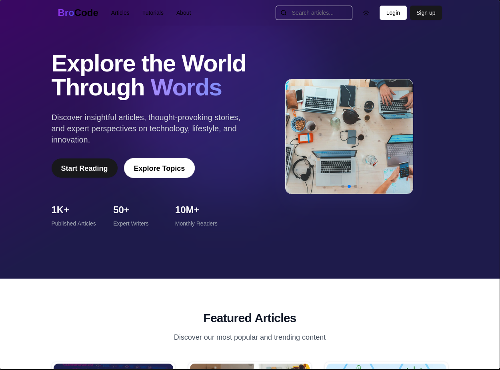

# Blog App

A comprehensive blog application built using modern web technologies including Next.js, React, Shadcn UI, Tailwind CSS, and TypeScript which provides a platform for users to create, edit, and view blog posts with a rich text editor and various other features.

## Features

- **Next.js**: A React framework for server-side rendering and static site generation.
- **React**: A JavaScript library for building user interfaces.
- **Tanstack Query**: Powerful data fetching and state management for React.
- **Shadcn UI**: A collection of accessible and customizable UI components.
- **Recharts**: A charting library built with React and D3.
- **Tailwind CSS**: A utility-first CSS framework for rapid UI development.
- **TypeScript**: A typed superset of JavaScript that enhances code quality and developer productivity.
- **Prisma**: An ORM for Node.js and TypeScript.
- **Clerk Auth.js**: Authentication technology.
- **Cloudinary**: Image and video management in the cloud.
- **Framer Motion**: A library for animations in React.

## Installation

To get started with this project, clone the repository and install the dependencies:

```sh
git clone https://github.com/Marvin-MM/Nextjs-BlogApp.git
cd Nextjs-BlogApp
yarn install
```

## Environment Variables
Create a .env file in the root directory of the project and add the following variables:
```
NEXT_PUBLIC_API_URL=your_api_url
DATABASE_URL=your_database_url
NEXTAUTH_URL=your_nextauth_url
NEXTAUTH_SECRET=your_nextauth_secret
CLOUDINARY_URL=your_cloudinary_url
```

Replace the placeholders with your actual values.

## Usage
To run the project locally, use the following command:
```
 yarn dev
```

This will start the development server and you can view the app at <http://localhost:3000>

To build the project for production, use the following command:
```
yarn build
```
## License
This project is licensed under the MIT License. See the LICENSE file for more details.

## Screenshot
